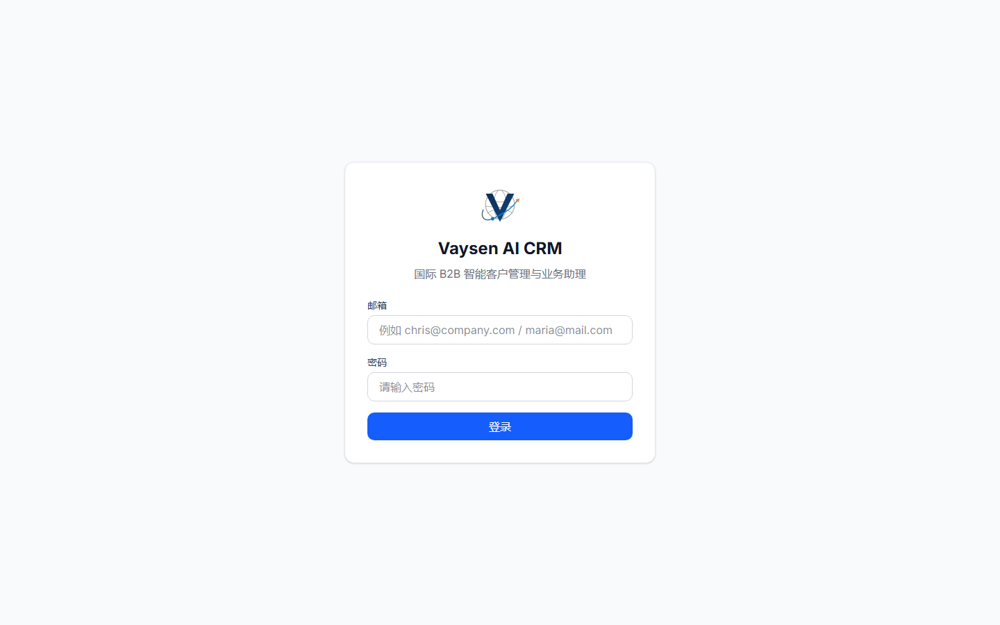
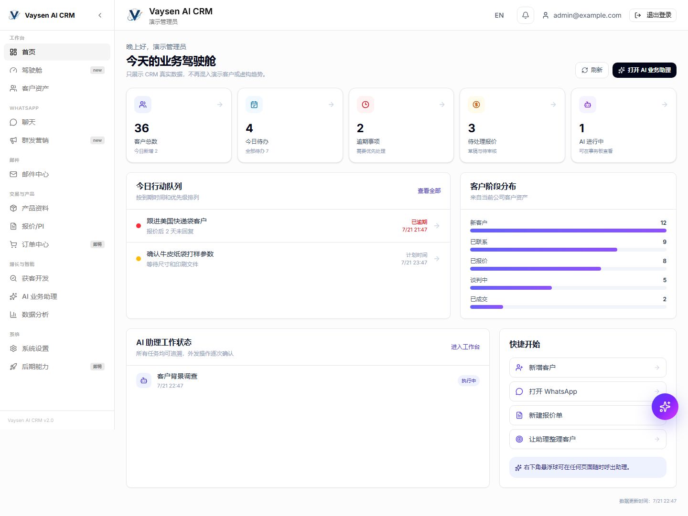

<p align="center">
  
</p>

<h1 align="center">Vaysen AI CRM</h1>

<p align="center">
  面向国际 B2B 团队的自托管 CRM、沟通工作台与可审计 AI 业务助理
</p>

<p align="center">
  <a href="https://vaysen.work/">Vaysen.work</a> ·
  <a href="docs/USER-GUIDE.zh-CN.md">使用指南</a> ·
  <a href="docs/DEPLOYMENT.zh-CN.md">部署指南</a> ·
  <a href="docs/WHITEPAPER.zh-CN.md">产品白皮书</a>
</p>

Vaysen AI CRM 将客户资产、订单与报价、邮件、WhatsApp、待办、客户背调和 AI 助理放在同一套可审计工作流中。项目支持 Linux 后端、Web 前端和 Windows Electron 客户端，适合在自有服务器、局域网或经过访问控制的私有网络中部署。

> 当前仓库是从内部业务系统生成的独立开源发行版。Git 历史、客户资料、真实价格、账号、密钥、服务器地址、会话文件、备份和内部验收记录均未导入。截图和演示数据均为合成内容。

## 界面预览

### 登录



系统不提供硬编码管理员密码。首次部署后通过注册流程创建第一个企业管理员，再按生产策略关闭公开注册。

### 业务驾驶舱



驾驶舱集中显示客户总数、今日待办、逾期事项、待处理报价、AI 任务、客户阶段分布和快捷入口。上图所有客户、任务和统计数字均为自动化测试生成的合成演示数据。

## 核心能力

- 客户资产、联系人、标签、评分、查重、自动建档与沟通时间线
- 报价、PI、订单、产品目录、美元价格和待办协作
- SMTP/IMAP 邮件工作台及可选 Brevo 入站 Webhook
- WhatsApp 会话工作台、Electron 辅助交付及可选 Evolution API 适配器
- OpenClaw 工具代理、AI 对话、执行轨迹、人工确认和真实工具回执
- 客户背调、线索搜索、销售分析和每日业务简报
- Next.js Web 前端、NestJS API、PostgreSQL、Redis/BullMQ
- Windows Electron 桌面客户端与 Docker Compose 自托管

## 使用前准备

| 项目 | 要求 |
| --- | --- |
| Node.js | `20.18.0` |
| npm | `10.x` |
| 数据服务 | PostgreSQL、Redis |
| 容器部署 | Docker Engine、Docker Compose v2 |
| 推荐服务器 | Ubuntu 22.04/24.04，8 GB 内存起步 |
| 桌面客户端 | Windows 10/11；正式分发建议配置代码签名 |

生产环境必须替换 `.env` 中所有 `change-me`、`replace-with` 和示例密钥。不要把 `.env`、数据库、客户附件、WhatsApp/OpenClaw 会话或备份提交到 Git。

## 五分钟本地启动

```bash
git clone https://github.com/Vaysen/VaysenAIOS-CRM.git
cd VaysenAIOS-CRM
cp .env.example .env

# 先编辑 .env，至少修改数据库密码、JWT 和加密密钥
docker compose up -d postgres redis
npm ci
npm run db:generate
npm run db:migrate
npm run dev
```

默认开发地址：

- Web：`http://127.0.0.1:4001`
- API：`http://127.0.0.1:4000/api`
- Swagger：`http://127.0.0.1:4000/api/docs`（仅在 `ENABLE_SWAGGER=true` 时启用）

如果你的 Docker、数据库或端口布局不同，请以 [部署指南](docs/DEPLOYMENT.zh-CN.md) 为准。正式部署前必须运行 Compose 配置校验、健康检查和备份恢复演练。

## 首次配置顺序

1. 打开注册页，创建第一个企业与管理员账号；仓库没有通用默认密码。
2. 登录后进入“系统设置”，填写企业名称、时区、默认币种和业务说明。
3. 删除零价格演示产品，导入企业审核后的产品、成本和美元售价。
4. 新建或导入客户，电话号码统一使用 E.164 格式，例如 `+12025550123`。
5. 配置 SMTP 与 IMAP；只有 SMTP 时只能发件，不能收件。
6. 按需配置 WhatsApp、AI Provider 和 OpenClaw；先在测试账号完成真实回执验收。
7. 创建测试客户，完整走一遍“客户 → 报价 → PDF → 人工确认 → 邮件/WhatsApp 交付”。

## 主要功能怎么使用

### 客户资产

- 从“客户资产”新增客户，优先填写公司、联系人、国家、邮箱和完整国际电话号码。
- 系统发现同一邮箱或 WhatsApp 号码属于其他客户时会阻止重复建档，请在查重或合并流程中人工确认。
- 只有昵称、状态文字或不可信号码时，系统不会生成看似完整但无法核验的客户档案。

### 产品、报价与订单

1. 在“产品资料”维护规格、MOQ、币种和经过审核的价格。
2. 从客户详情、报价页或 WhatsApp 侧栏创建报价草稿。
3. 核对数量、单价、折扣、贸易条款、交期、税费、样品费和开模费。
4. 生成 PDF 后进行最后一次人工确认，再选择邮件、WhatsApp 或下载后人工交付。
5. 客户确认后建立订单，并持续维护付款、生产、发货和交期状态。

开源仓库中的 `backend/src/modules/products/data/usd-price-catalog.json` 是零价格合成数据，不能直接用于商业报价。

### 邮件

- 在“邮件账号”中同时填写 SMTP（发件）和 IMAP（收件），先执行连接测试。
- 如供应商不开放 IMAP，可配置 Brevo 等入站解析 Webhook。
- 正式外发前设置每日/每小时限额、发送间隔、退订说明和测试收件人。

### WhatsApp

- Electron 模式可辅助操作 WhatsApp Web；服务端自动化可选 Evolution API。
- 首次发送前核对当前会话、客户身份和目标号码是否一致。
- 自动附件被平台策略阻止时，可下载系统生成的 PDF，或使用人工拖拽交付作为兜底。
- 是否发送成功必须以渠道返回的真实消息编号为准，聊天文案不等于执行结果。

### Vaysen AI 业务助理

AI 工作台包含对话、事务、翻译/回复、业务汇报和可审计执行轨迹。推荐给出明确业务对象与目标，例如：

> 查询客户 `DEMO-001` 的最近沟通，生成英文跟进草稿，并创建明天上午的跟进待办。

读取和分析可以直接执行；修改客户、创建订单或对外发送时，应根据部署者的权限策略显示目标、渠道、内容摘要与确认状态。只有看到工具调用状态和后端真实回执，才算完成。

## Windows 客户端

在 Windows 构建机执行：

```powershell
cd electron
npm ci
$env:NEXT_PUBLIC_API_URL = "/api"
npm run dist
```

安装包输出在 `electron/release/`，该目录默认不提交。局域网客户端推荐使用同源 `/api`，由 Electron 主进程代理到经过校验的后端地址。未签名安装包可能触发 SmartScreen；正式交付前应验证安装、卸载、覆盖升级、快捷方式、离线提示和崩溃日志。

## 生产部署与备份

- Linux 推荐运行 PostgreSQL、Redis、API、Web 前端和可选 OpenClaw；Windows 只安装客户端。
- 远程访问优先使用 ZeroTier、Tailscale、WireGuard 或带访问控制的 HTTPS，不直接暴露数据库和 Redis。
- 每日备份 PostgreSQL 和上传目录；会话数据与数据库备份分开加密保存。
- 定期在隔离环境执行真实恢复，不能只检查“备份文件存在”。
- 上线前确认 `/health`、登录、客户创建、报价生成、邮件和 WhatsApp 测试全部通过。

## 常见问题

| 问题 | 检查项 |
| --- | --- |
| AI 提示未启用 | `AI_EXTERNAL_CALLS_ENABLED`、Provider API Key、Base URL、模型名和后端日志 |
| 邮件能发不能收 | 是否配置 IMAP 或入站 Webhook；SMTP 本身不提供收件 |
| WhatsApp 无法自动建档 | 是否取得完整 E.164 号码、是否与已有客户冲突、会话来源是否可信 |
| AI 声称完成但系统无变化 | 查看执行轨迹和工具回执；没有真实回执就不是完成 |
| Electron 连不上后端 | 检查运行时 API 地址、私网 origin 白名单、后端健康状态和防火墙 |
| 页面无数据 | 检查当前租户、用户权限、数据库迁移和是否导入了自己的业务数据 |

更多说明见 [完整使用指南](docs/USER-GUIDE.zh-CN.md)。

## 文档

- [产品白皮书](docs/WHITEPAPER.zh-CN.md)
- [使用指南](docs/USER-GUIDE.zh-CN.md)
- [部署指南](docs/DEPLOYMENT.zh-CN.md)
- [技术架构](docs/ARCHITECTURE.md)
- [品牌资源规则](docs/BRANDING.md)
- [开源去敏报告](docs/OPEN-SOURCE-SANITIZATION.md)
- [依赖安全基线](docs/DEPENDENCY-RISK.md)
- [安全政策](SECURITY.md)

## 验证与贡献

```bash
npm run verify:public-release
npm run verify:node-engines
npm --workspace backend run typecheck
npm --workspace frontend run typecheck
```

公开发布门禁会阻止内部品牌、真实服务器地址、私钥、数据库、会话文件、常见密钥形态和非零私有价格进入提交。提交改进前请阅读 [CONTRIBUTING.md](CONTRIBUTING.md)。

## 关于 Vaysen AI

[Vaysen.work](https://vaysen.work/) 是 Vaysen AI 的官方网站，集中介绍企业 AI 落地、Vaysen AI OS、智能业务系统、独立站与全球增长服务。Vaysen AI CRM 是 Vaysen AI OS 产品体系中的开源 CRM 项目，目标是让中小型国际 B2B 团队能够在自有服务器或局域网中部署可审计、可扩展、以真实业务执行为中心的 AI 客户管理系统。

- 官方网站：[https://vaysen.work/](https://vaysen.work/)
- 产品与服务：企业 AI Agent、业务自动化、CRM/ERP、网站与全球增长解决方案
- 问题与建议：通过 GitHub Issues 提交可复现场景、日志脱敏摘要和期望行为

## License

源代码采用 [Apache License 2.0](LICENSE)。Vaysen 名称、Logo 和品牌资源不因代码许可证而授予商标或品牌授权，详见 [TRADEMARKS.md](TRADEMARKS.md)。第三方组件仍适用各自许可证。

---

English summary: Vaysen AI CRM is a self-hosted international B2B CRM with customer assets, email, WhatsApp, quotations, orders, research, and auditable AI-agent workflows. It is an open-source project in the Vaysen AI OS product family. Visit [Vaysen.work](https://vaysen.work/) and refer to the Chinese user and deployment guides for the currently verified scope.
