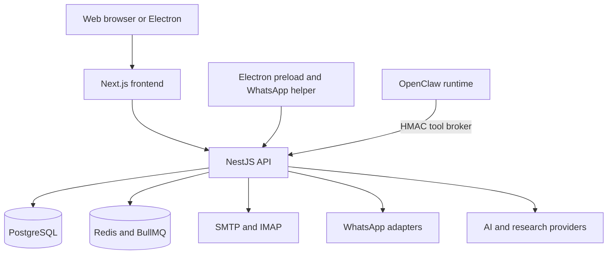

# Architecture

## Trust boundaries

- Frontend never receives database, SMTP or provider secrets.
- Electron exposes an explicit IPC allowlist instead of Node.js primitives.
- OpenClaw reaches CRM operations through the HMAC-authenticated tool broker.
- Tenant and role checks remain in the API even when an AI tool initiated the request.
- External sends must return a provider message identifier or an explicit failure.

## Main directories

- `frontend/`: Next.js application and Electron static export.
- `backend/`: NestJS API, Prisma schema, workers and integrations.
- `electron/`: Windows desktop shell, IPC and WhatsApp Web helper.
- `deploy/openclaw/`: OpenClaw integration and CRM tool plugin.
- `scripts/`: deployment, backup and verification utilities.
- `assets/brand/`: approved Vaysen public brand exports.
