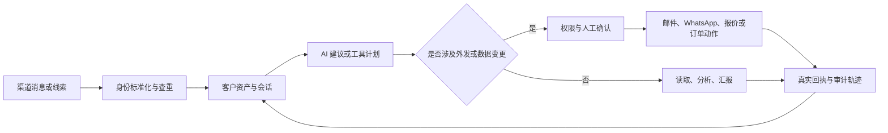

# Vaysen AI CRM 产品白皮书

版本：开源版 1.0 草案
更新日期：2026-07-21

## 1. 产品定位

Vaysen AI CRM 是面向国际 B2B 销售团队的自托管业务操作系统。它解决的不是“多一个聊天机器人”，而是把客户身份、沟通、报价、订单、任务和 AI 执行放进同一条可追溯链路。

适用团队包括外贸制造商、跨境服务商、批发商、分销商以及需要在局域网或私有服务器运行 CRM 的中小企业。

## 2. 典型问题

- 客户资料散落在 Excel、邮箱、WhatsApp 和个人电脑中。
- 同一客户因名称、邮箱或电话号码不同而重复建档。
- 报价、订单和沟通上下文无法交接。
- AI 只能生成文案，不能调用业务工具或给出真实回执。
- 外部 SaaS 难以满足数据驻留、局域网运行和可控集成要求。

## 3. 产品组成

| 组成 | 作用 |
|---|---|
| Web 工作台 | 客户、沟通、报价、订单、任务、分析和系统设置 |
| Electron 客户端 | Windows 安装包、WhatsApp Web 辅助、桌面通知与本地运行时配置 |
| NestJS API | 鉴权、租户隔离、业务规则、队列、文件与外部渠道适配 |
| PostgreSQL | 客户、身份、沟通、订单、报价、任务和审计数据 |
| Redis/BullMQ | 邮件、搜索、背调和异步任务 |
| OpenClaw 适配层 | 将自然语言计划转换为受审工具调用并返回真实回执 |

## 4. 核心业务闭环

## 5. AI 业务助理

AI 助理可以读取授权范围内的 CRM 数据、整理工作简报、查询客户和订单、创建待办、生成背调任务、准备报价草稿，并通过工具代理执行经过授权的动作。

开源版展示的是“可审计执行轨迹”，包括计划、工具名称、关键参数摘要、状态和系统回执。模型供应商的私有隐藏推理不会被伪装成可验证事实。

默认安全边界：

- 读取受租户和角色权限约束。
- 修改客户、订单或外发消息必须产生工具回执。
- 单客外发需要目标唯一、渠道在线且满足确认策略。
- 任意 Shell、任意 SQL、密钥读取和无边界批量外发不作为默认业务能力。
- 部署者可以扩展工具，但应保留最小权限、审计和撤销机制。

## 6. 客户身份与自动建档

系统以标准化邮箱、E.164 电话号码、WhatsApp 身份和可验证来源作为身份锚点。仅有显示名称时，不应自动把聊天昵称当成电话号码或公司名。发生冲突时进入人工合并流程，而不是覆盖已有客户。

## 7. 沟通渠道

### 邮件

- SMTP 发送与连接测试
- IMAP 收件与邮件工作台
- 可选 Brevo 入站解析
- 模板、退订、黑名单、发送限额和事件记录

### WhatsApp

- Electron 内嵌 WhatsApp Web 辅助
- 可选 Evolution API 服务端通道
- 客户身份关联、文本草稿、报价交付和真实消息回执

WhatsApp、Meta、Brevo、邮箱服务商和 OpenClaw 均是独立第三方项目或服务；本项目不代表其官方产品，也不绕过其平台政策。

## 8. 数据与隐私

- 数据默认存储在部署者控制的 PostgreSQL、文件目录和渠道会话目录。
- 邮箱密码应使用独立加密密钥加密；密钥不进入数据库备份或 Git。
- 运行时 `.env`、上传文件、WhatsApp 会话、OpenClaw 数据、数据库备份和日志默认被 `.gitignore` 排除。
- 公开仓库只含合成示例，不含真实客户、价格、联系方式或生产拓扑。

## 9. 部署方式

推荐结构是 Linux 主机运行 API、数据库、Redis、队列和可选 OpenClaw；浏览器或 Windows Electron 客户端通过可信局域网、ZeroTier/Tailscale 或受控反向代理访问。不要直接把数据库、Redis 或 OpenClaw 管理端口暴露到公网。

## 10. 权限模型

建议角色：平台管理员、企业管理员、销售主管、销售成员、只读审计员。权限应按租户、资源、动作和渠道四层判断，外发、删除、合并、导出和密钥操作应单独授权。

## 11. 已知边界

- AI 输出需要业务人员复核，不构成法律、合规、信用或财务结论。
- 邮件送达率、WhatsApp 账号稳定性和第三方 API 可用性不由本项目保证。
- Electron 安装包需要在 Windows 构建机重新构建；公开仓库不附带私有签名证书。
- 示例价格全部为零，必须导入企业自己的审核价格后才能报价。
- 语音客服模块仍为实验性能力，默认不应在生产导航中启用。

## 12. 路线图

1. 稳定客户、订单、报价、邮件和 WhatsApp 主链路。
2. 建立插件化工具权限、审批策略和审计查询。
3. 完善自托管升级、备份恢复和观测能力。
4. 扩展行业模板、知识库和可复用自动化。

## 13. 开源目标

开源的目的，是让中小企业可以审计、部署和改造一套真实业务系统，而不是发布包含私有经营数据的内部快照。代码贡献必须通过去敏门禁、安全测试和许可证检查。
